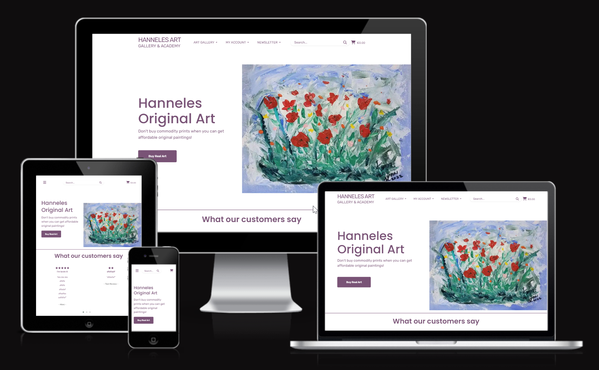
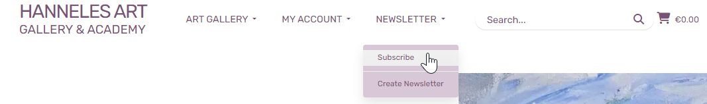
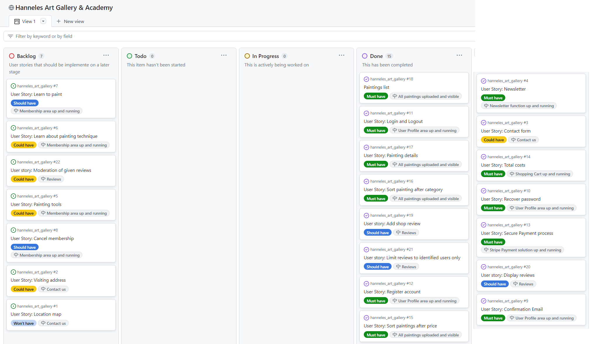
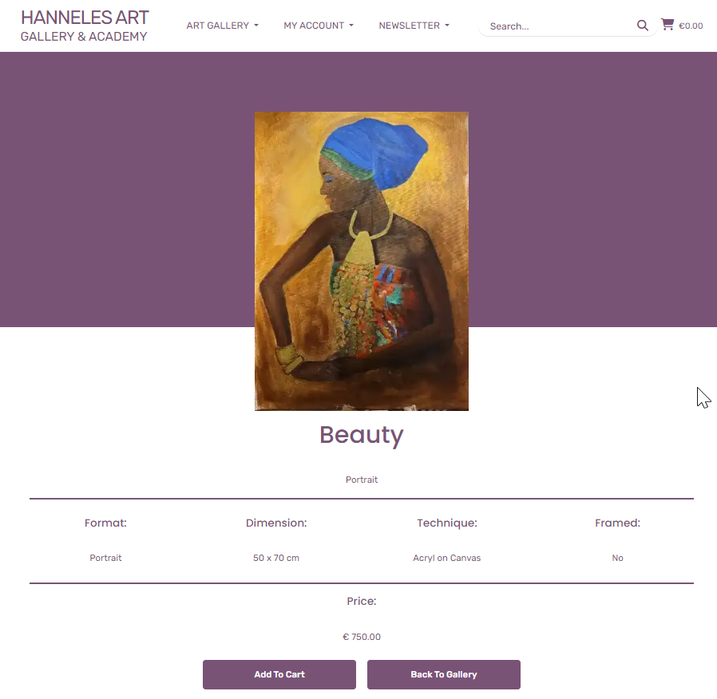
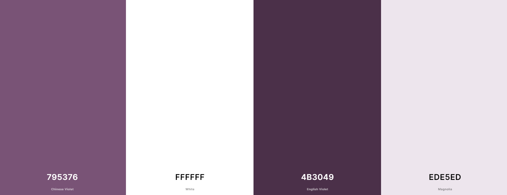
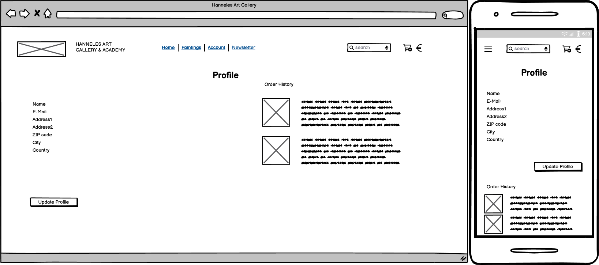
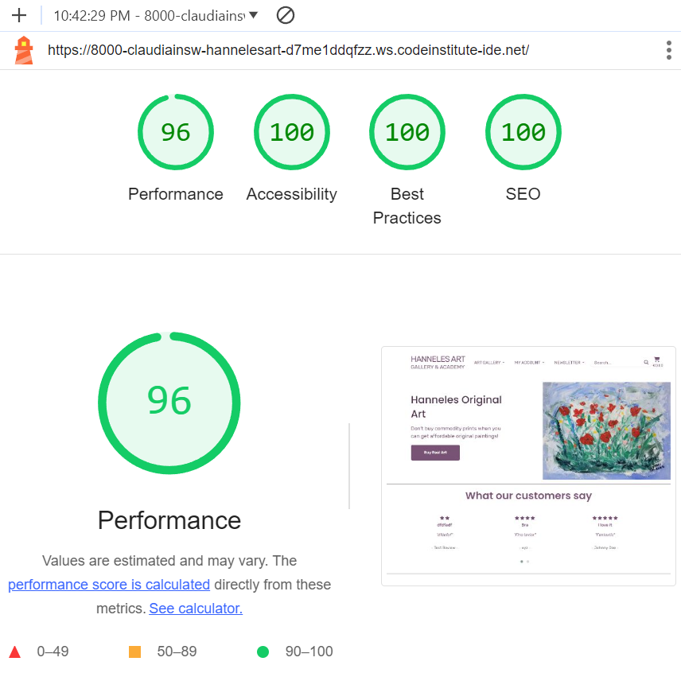
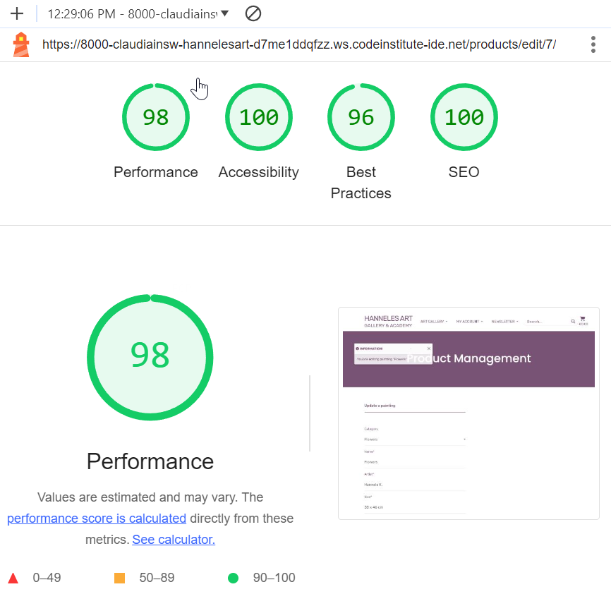

# Hanneles Art Gallery

## Introduction

### Project Description

[Hanneles Art Gallery](https://hanneles-art-gallery-99fb21934da8.herokuapp.com/) is a fictional eCommerce website that offers original paintings to affordable prices. 
The painting images and descriptions are used with kind permission of Hannele Kaarlejärvi, the artist. 

The webshop includes a preview of all painings with links to a larger image and more detailed information. Paintings can be added to the shopping cart but as they are unique only a quantity of 1 can be added. In the shopping cart, paintings can be removed, or the user can proceed to the checkout page. For Payment purposes the website is connected with Stripe. Test purchases can be performed with [Stripes test cards](https://stripe.com/docs/testing/).
Users can also register for an account where the order history is stored.  

### Business Model

Hanneles Art Gallery is a B2C (Business to Customer) business even though also businesses can purchase paintings. 
Target group are users who want to decorate their homes but want to avoid off-the-shelf-prints and instead look for real paintings. 

#### Phase 1 (in scope for this project)
Hanneles Art Gallery sells a limited range of paintings to fair conditions. 

#### Phase 2 (out of scope for this project)
An "Art Academy" will be launched including a membership area where interested users may find tutorials about how to start painting and what tools to use. Beginners level tutorials will be free of charge and a member fee will be charged for more advanced tutorials. 

#### Phase 3 (out of scope for this project)
The webshop will widen its scope and start selling high quality tools for painting. 

### Web Marketing Strategy

#### Target Audience
According to [Interior Design magazine](https://interiordesign.net/designwire/women-in-design-confronting-the-glass-ceiling/) around 70% of all Interior Designers in the US are women and also in private homes it's often the women who choose the interior decor. Furthermore, many women see painting as an opportunity for self-expression and stress-reduction. For that reason the main target audience of the webshop as well as for phase 2 and 3 are women. 

#### Facebook Business Page
In the start phase of the business we will concentrate on Facebook as Marketing platform. That way the artist can create a more personal relationship with followers and keep the communication ongoing by answering comments and questions online. This allows also to test different approaches and validation.

By the time of writing this ReadMe file (2024-07-06) the Facebook Page [Hanneles Art Gallery](https://www.facebook.com/profile.php?id=61555624246656) has 5 Followers.

#### Newsletter
Users can subscribe to the newsletter that will contain information about new paintings available in the shop but also act as "appetizer" as we will tell some background stories about the making of the paintings and the inspiration behind it. 
It will also include information about exhibitions and other events. 

Users can easily subsribe to the newsletter via the Newsletter-link in the navigation bar. 
Only logged-in administrators will see the "Create Newsletter"-link.

### SEO - Search Engine Optimization
Prior to project start some brainstorming resultad in a number of short and long-tail keywords. Using three different browsers and a mobile, resulted in a couple of keyword volume and competition analysis results from [Wordtracker](https://www.wordtracker.com/).
Also Google search with suggested search phrases as well as related searches was used. However, original paintings seem to be a niche product and Googles suggestions were not comprehensive. 

The selected keywords and long-tail phrases where included in meta description and keywords as well as in the headings and button texts. 

Keyword Research Wordtracker

Screenshots Wordtracker Results:

Keyword Research Google

Screenshots Wordtracker Results:

#### sitemap.xml
To further improve searchability of the website a sitemap.xml file was included, using [XML Sitemaps.xml](https://www.xml-sitemaps.com/).

#### robots.txt
The robots.txt file allowes crawl access to all parts of the website but the accounts and checkout pages.

#### Privacy Policy
To comply with GDPR a Privacy Policy has been created using the [Privacy Policy Generator](https://www.privacypolicygenerator.info/). The layout was adapted to the style of the webshop and added to the footer of the Home Page. However, I noticed that the English in the auto-generated file is quite bad but as it was suggested to use this website during the course I used it anyway. 

### UX

As the webshop only sells paintings the focus in the design was on presenting the paintings. This was achieved with an overview page that allows for a good overview of all paintings (including filtering and sorting by price) and a large image of the painting when clicking on the "Details" button under each image. The user then can see a large image and can "study" the painting in detail before scrolling down to see a short description. As users usually don't buy a lot of paintings but take their time to choose one I concluded that a good picture is more important than size, format or price. 

The color scheme was chosen after the mostly female target group. 

Viola Purple is a medium dark, medium bright shade of Magenta. It belongs to the color family Dark Pastel Magenta, and it has medium lightness and low saturation. Viola Purple is a warm color.

A free Bootstrap 4 template was used that was adapted to fit the project.

## Agile 

Agile Methodology was used during the project.
User stories were created at project start, and prioritized according to MOSCOW way of working. 
Github was used to document the user stories by using the build in Issues resp. project functionality.
For each user story a list of tasks and acceptance criterias was created.
Working progress was illustrated in a canban board.
All user stories labelled "Must have" have been closed. 
Open user stories have been collected in the backlog section. 

The project is open for public access and can be visited here.

[Agile Project](https://github.com/users/ClaudiaInSweden/projects/11)

## Relationship Diagram

I have used Mermaid to auto-generate an interactive ERD for the models.
[Live-Link to ERD](https://mermaid.live/edit#pako:eNqVVsFuozAQ_RXEuT1sj7m1CVmhpE1FyK5WioQcPJBZGZsau91s039fUyAx1KRdDkmceTP2vHkz5tVPBQV_4oOcIcklKbbcM88qmgWR99os6me6J3KOwKgnJAWZcF3sQHqPizNkLiRgzhdw8HRlIKUUGTLw5gtXmEwzlnBSwNkYFARZY4X6p8ut3AsO7e4ue6UkgEoIpRKq6tvnkBvnLqJSNTEumxIv3PpfaK7koTGlzeJsnREFMRbQmKlZWTZIsSBtvhQYPkPP1TY3nCuhCBtBmNJxOkTE8Ed1ATBHTliSEqlGSMESkhJpY33bcksJy_AhCOPg3laEVe734xktXPVqbQGMFKhOVc8ccgU5tNs_acIVqrH8GXJABYWd4OmE09VDfDuN3WqtFdZT6bjIegdSosTUxWRhNENy-LzGp_NFwY8w-DlCXd0p47RIopDnrrwoViUjh0EHne0SnhFeEsMpA1carX0n6EW5JqkE8zUUxXpzt55G4V0Qre28htz2iHcENy34IfT9bbisKxo8jFS00rvfYLRkxz7nlQrDH1dDidzGwfdV9OuLGrGmlETglNk8n4I-RqvZpq87q7CpSTAX8jAy_sbqZtoTK3eH4l-nRyZkQZweCtI9xyftdjOzviO_fu6EYEB4u5dgdKQVS4mpFTAsTDM0Fix6fbGJltb_iZbDvt2sg8hwOA-Xgc3hikMszEfj_KE_rBaAjGimks-uhA73havBDb25uPuFq6LDXLgyOkjv6ugPX-94vL4-Hnt8TbytvwMmeF6ZUbX1XbO6dWti_IdDp-vaRUIG0vZoh5l1pHfci0Rl-s7bHTpgF6VFnjqwRqeMVBVmCEbvVedgpzcMb5_cv_ILMJJHal5b3nWz9dUeTDv5NbQltI76ZqBEK7E-8NSfKKnhypdC53t_khFWmZUu6znUvvk0kLd_6NHQBQ)

## Features

### Navigation

The responsive navigation bar on top of the page includes the following links: 

- Logotype/Home Page
- Art Gallery - a dropdown list to select either all paintings or filtered by category 
- My Account - shows different options depending on the login status. 
  - User is not logged in:
    - Register
    - Login     
  - User is logged in:
    - "Welcome back" and Username is displayed in the first line
    - My Profile
    - Logout
  - Administrator is logged in:
    - "Welcome back" and Username is displayed in the first line
    - Add Product
    - My Profile
    - Logout
- Newsletter - shows different options depending if administrator is logged in.

  Users will only see the option "Subscribe" while logged-in administrator also has access to "Create Newsletter"

Also available is a search bar and the shopping cart that shows the total sum of the items in the shopping cart in Euro. On small screens the amount is hidden and the logotype switches to a clickable icon, to allow a reasonable size of the search field.
The search field searches through title, painting technique, size and the category field and search results are displayed on the paintings overview page. An information text informs the user about the number of matches and also contains a link back to the overview page.

The responsive navigation bar is identical on each page to enable easy navigation on all devices. It allows users to navigate between pages on all devices without the need to use the "back" button.

### Home Page

The Home page is the starting point for users. It displays one of the paintings and informs the user about the purpose of the website. Keywords and phrases are used in the short intro text and the button for improved SEO. 

The lower part of the page shows reviews that have been given from users. Both the heading and the review text are linked to the review page.

Below the review part contact details are available.

The section is split into three parts:

- address
- contact detail
- links to social media

The contact part includes a "Contact us" icon & text that links to the contact us form.

On bottom of the page I had to put a link to the template origin as requested in the template license agreement. On the right side of the page the user can find a link to the Privacy Policy page that opens in a new tab.

### Contact us

The contact form includes a dropdown list to select a topic and a message box that allows for 500 characters. Wenn the text reaches 401 characters the character counter in the bottom left corner of the form will change to a red color.

### Reviews

The reviews page displays given reviews including star rating. Also the average customer rating is visible. 

Depending on the log in status, a user will be prompted to log in to write a review or will see a personalized notification that a review has already been given.  

#### User not logged in

#### User is logged in

#### User has already submitted a review

### All Paintings

The All Paintings / Products page lists all paintings with an image and short information. The details button leads to a product detail page with a large image of the painting and some information about the size and the technique used. 

A button in the bottom right corner enables a fast return to the top of the page at any moment.

The buttons "Update" and "Delete" are only visible for logged in administrators of the page. 

### Painting details

Again, the focus is on the painting and the user might need to scroll down to see the price.

To keep the interest alive and display a full collection of the artwork it was decided to leave the sold paintings in the shop but with a "SOLD" label and no price and no "Add to cart" button available. 
The status will be updated automatically to "sold" when an order has been successfully submitted.

### Shopping cart

On the shopping cart page the user can see an overview of the paintings in the shopping cart as well as total costs including a delivery flat rate. As the paintings don't differ a lot in sizes and can easily be packaged I decided to use a flat rate for delivery. 
Here the user also has the possibility to remove a painting from the cart or go back to the paintings overview page. 

If the user deletes all items in the shopping cart some info text will be displayed, telling the user that the shopping cart is empty; and a button directing to the paintings overview page. 

If the user clicks the "Proceed to Checkout"-button the user will be directed to the checkout form. Also here the user can see what paintings are in the shopping cart and the total sum. 

### Checkout

On the checkout page the user can see a short summary of the order on the right side and a form on the left side. 
The form asks for name, email and the delivery address. When the user is already registered and logged in, the address will be pre-populated. As the location for the webshop is in Sweden, it was decided to use only the address fields that are common in Sweden, so state/county has not been used. 

On the bottom of the page you can find the Stripe credit card section for the user to fill in credit card number, valid date, CVV and zip code.
As only a Stripe test account is used, an error will be displayed when a credit card number other than the test card number 4242 ... is entered.

Also here the user can still choose to interrupt the checkout process and go back to the shopping cart. 

When the user completes the form and clicks on Complete Order the Checkout Success/Order confirmation page is opened. 

### Order confirmation

While the payment transfer is ongoing a spinning overlay is displayed to inform the user that the transaction is ongoing.

Once the transaction is completed successfully, an order confirmation page is displayed informing the user that a confirmation email has been sent to the provided email address. Also an order summary with the delivery address is visible as well as a button back to the paintings page. 

### My Account

Under the My Account menu tab in the navigation the user will see different options depending on the log-in status:
- When the user is not logged in a Registration and a Log-in Option are available. They open Django-Allauth templates which are Bootstrap-styled to match the rest of the website. The log-in page offers also the possibility to restore the password in case it's been forgotten.
- When the user is already logged in, a Log-out option will be visible instead as well as the Profile page. 
- When a user is logged in as a superuser, the Add Product link is available that leads to a page that enables to add another painting. 

### Newsletter

Users have the possibility to subscribe to the newsletter. They just need to enter a valid email address. A confirmation message will be displayed when the subscription was successful.

Only a logged-in administrator can see the link to the Create Newsletter form in the navigation. 

As simple form is used to write a newsletter including a subject and the newsletter content. The form is pre-populated with an unsubscribe-link that leads to the unsubscribe page. 

## Typography and color scheme

### Font
I tried not to overload the pages but keep them clean and spacious. Main focus was on presenting the paintings. The Bootstrap template used the font "Rubik" which I liked very much and used in the project. It harmonizes very well with the layout and is good readable even in small sizes.

Rubik is a sans serif font family with slightly rounded corners designed by Philipp Hubert and Sebastian Fischer at Hubert & Fischer as part of the Chrome Cube Lab project.

Rubik is a 5 weight family with Roman and Italic styles, that accompanies Rubik Mono One, a monospaced variation of the Black roman design.

### Color
The original more pinkish color of the bootstrap template resultad in a lower accessibility score in the Google Lighthouse tool. So I decided to use a darker color but still in the same color family. 

Viola Purple is a medium dark, medium bright shade of Magenta. It belongs to the color family Dark Pastel Magenta, and it has medium lightness and low saturation. Viola Purple is a warm color. It harmonizes very well with the paintings and does not distract when used as background color on the product details page. 

Changing to Viola Purple, improved the accessibility score to 100 on almost all pages. 

## Wireframes

Wireframes for desktop and smartphone have been created with [Balsamiq](https://balsamiq.com/wireframes/)

### Homepage

### Reviews

### Products

### Product Details

### Shopping Cart

### Checkout

### Profile

### Contact us

### Newsletter

## Technologies used

### Languages
- HTML5
- CSS
- JavaScript
- jQuery
- Python
- Django

### Technologies and programs
- IDE: Gitpod/VS Code
- Repository: GitHub
- Database: ElephantSQL
- Payment solution: Stripe
- Storage: AWS S3 for storing media and static files
- Deployment: Heroku

### Software and frameworks
- [Colorlib template "Pillowmate"](https://themewagon.com/themes/free-bootstrap-4-html5-responsive-online-store-template-pillow-mart/)
- [Bootstrap 4.6](https://getbootstrap.com/docs/4.6/getting-started/introduction/)
- [Fontawsome Icons](https://fontawesome.com/icons)
- [Favicon](https://favicon.io/)
- [Birme](https://www.birme.net/)
- [Snagit Editor](https://www.techsmith.com/screen-capture.html)
- [Color Scheme](https://coolors.co/?home)
- [Mermaid](https://mermaid.js.org/)

## Testing

### Validator Testing

#### HTML

One error was returned when passing through the [W3C Markup validator](https://validator.w3.org/). The error is on the Django-Allauth Sign-up Page and documented in the [Bugs section](https://github.com/ClaudiaInSweden/hanneles_art_gallery#bugs) of this file.
Validation has been performed both via address and text input on 2024-07-09.

 
| Page  | No Errors | Errors | Info |
| ------------- | :-------------: | :-------------: | :-------------: | 
| index  |  |  |  |   
| reviews  |  |  |  | 
| privace_policy  |  |  |  |  
| contact_us  |  |  |  | 
| products  |  |  |  | 
| product_details  |  |  |  | 
| add_product  |  |  |  | 
| edit_product  |  |  |  | 
| delete_product  |  |  |  | 
| cart  |  |  |  |   
| checkout  |  |  |  | 
| checkout_success  |  |  |  |  
| create_newsletter  |  |  |  | 
| subscribe  |  |  |  | 
| unsubscribe  |  |  |  |  
| profile  |  |  |  | 
| signup  see [Bugs](https://github.com/ClaudiaInSweden/hanneles_art_gallery#bugs)  |  |  |  |  
| login  |  |  |  |  
| logout  |  |  |  |  

#### CSS

No errors were found when passing the css stylesheet that were created by myself through the [W3C CSS Validator](https://jigsaw.w3.org/css-validator/) validator.
However, there were 3 errors and 1450 warning found in the third party resources.

**base.css**

**checkout.css**

**3rd party resources.css**

#### Google Chrome Lighthouse Reports

These reports present the results of Lighthouse testing to assess the performance, accessibility, best practices and SEO of Hanneles Art Gallery.

The tests were executed using the Google Chrome browser's DevTools.
Performance details for each page can be found by clicking the expand button.

Lighthouse Performance 

**Homepage**

**Reviews**

**Products**

**Product Details**

**Edit Product**

**Add Product**

**Delete Product**

**Cart**

**Checkout**

**Checkout success**

**Contact us**

**Create Newsletter**

**Subscribe**

**Unsubscribe**

**Login**

**Logout**

**Signup**

**Profile**

**Privacy Policy**

#### Python validation
No errors were returned when passing through the [CI Python Linter](https://pep8ci.herokuapp.com/).
Details for each part can be found by clicking the expand button.
 

Home 

**model.py**

**forms.py**

**views.py**

Products 

**model.py**

**forms.py**

**views.py**

Cart 

**model.py**

**forms.py**

Checkout 

**model.py**

**forms.py**

**views.py**

**signals.py**

**webhooks.py**

**webhook_handler.py**

Profiles 

**model.py**

**forms.py**

**views.py**

Newsletter 

**models.py**

**forms.py**

**views.py**

Contact us 

**models.py**

**forms.py**

**views.py**

## Manual Testing

As the manual testing file is too extensive to add directly here in the Readme it's saved in a separate file.

[Manual Testing](static/readme-docs/others/manual-testing.pdf)

## Browser Testing

Functionality, links, layout, and responsiveness were tested with the following browsers without any major issues:

- Microsoft Edge Version 117.0.2045.47
- Firefox Version 118.0.1
- Brave Version 1.58.135
- Google Chrome Version 116.0.5845.188

## Deployment
A Repository was created in Github, and apps and templates were developed using VS Code. At an early stage a database on ElephantSQL was connected to the project as well als an AWS S3 Bucket to store static and media files. The following packages were installed in VS Code and added to the requirements.txt:

asgiref==3.8.1
boto3==1.34.37
botocore==1.34.73
dj-database-url==0.5.0
Django==3.2.24
django-allauth==0.57.0
django-countries==7.2.1
django-crispy-forms==1.14.0
django-js-asset==2.2.0
django-storages==1.14.2
gunicorn==21.2.0
jmespath==1.0.1
numpy==2.0.0
oauthlib==3.2.2
pandas==2.2.2
pillow==10.2.0
psycopg2==2.9.9
PyJWT==2.8.0
python3-openid==3.2.0
pytz==2024.1
requests-oauthlib==2.0.0
s3transfer==0.10.0
sqlparse==0.4.4
stripe==8.1.0
tzdata==2024.1
urllib3==1.26.18

### The following steps were taken to deploy the app to Heroku:
- Create a new app on Heroku
- Choose an unique name for the app and select your region
- Click on Create App
- When ready, add config vars in the respective hidden field in the Settings tab.
- Add the buildpack "Heroku/Python"
- Select the Deploy tab and add connect to Github under Deployment method, select the repository that shall be deployed
- Finally, choose if you want to enable automatic or manual deployment.
- Wait until the app is loaded and open your website.

### Forkning
A fork is a new repository that shares code and visibility settings with the original repository.
You're welcome to do so.
Please refer to the official GitHub documentation on how to fork my repository.
[Link to the GitHub Documentation](https://docs.github.com/en/pull-requests/collaborating-with-pull-requests/working-with-forks/fork-a-repo#forking-a-repository)
[Link to the Repository](https://github.com/ClaudiaInSweden/hanneles_art_gallery)
Please note: For Copyright questions/requests please contact the artist!

### Cloning
Cloning a repository pulls down a full copy of all the repository data that GitHub.com has at that point in time, including all versions of every file and folder for the project.
You're welcome to do so.
Please refer to the official GitHub documentation on how to clone my repository.
[Link to the GitHub Documentation](https://docs.github.com/en/repositories/creating-and-managing-repositories/cloning-a-repository)
[Link to the Repository](https://github.com/ClaudiaInSweden/hanneles_art_gallery)
Please note: For Copyright questions/requests please contact the artist!
  

## Bugs

- When a logged in user opens the Profile page and there is no saved data, it is possible to save the empty form by clicking on Update Profile. This is because the fields in the profile form are not mandatory.

- When creating the newsletter function I originally used the Django send_email() method but realized after the first tests that the email addresses all are visible in the "send to" field which of course is impossible to use due to GDPR. But when I checked the Django Documentation I found the EmailMessage class and with just a few changes in the code, that issue was solved.

- When Code Institute moved to GitHub Enterprise I was recommended by Code Institute Tutor Support to update to a newer version (0.57.0) of django-allauth as the older version couldn't be re-installed. 
However, this version seems to have a major bug:
When using the crispy form tag in the sign up template, a html error is returned when using the HTML validator. 

I solved this by extracting the html code from the Google devtool, correcting the html code that causes the error and use this instead of the crispy form tag. Unfortunately, when doing so, all validation of the form is lost besides the check if all required fields are filled in. The form was not submitted either. That means, when the user submits the form, nothing happens. 
From a user perspective a non-functioning sign-up form definitely is a very bad experience whereas the user doesn't notice the html error. So, I changed the form back to a crispy form. For the next release a working and error-free version of django-allauth should be installed.

## Credits

- [404 Error Image](https://www.vecteezy.com/free-vector/painting-stand)
- [Bootstrap Template "Pillow Mart"](https://themewagon.com/themes/free-bootstrap-4-html5-responsive-online-store-template-pillow-mart/)
- [Paintings](https://artportable.com/profile/@hansu) - For Copyright questions/requests please contact the artist!

## Tutorials & Support

- [Icon inside Search Input Field](https://youtu.be/3Y0_DcOYPlw?si=TOaj9_GEYQpPt2So)
- [Reviews & star rating](https://www.youtube.com/watch?v=TIDldj2BDuY&t=428s)
- Newsletter section:
    - [KenBro Tech](https://www.youtube.com/watch?v=hWtlskOaFNI)
    - [Master Code Online - Subscribe](https://www.youtube.com/watch?v=Hy94jBBgvpk)
    - [Master Code Online - Unsubscribe](https://www.youtube.com/watch?v=q2B1VpjDjMQ)
- [Displaying character counter](https://codepen.io/patrickwestwood/pen/gPPywv)

- [Stack overflow](https://stackoverflow.com/)
- [mdn web docs_](https://developer.mozilla.org/en-US/)
- [W3Schools](https://www.w3schools.com/)
- [Django Documentation](https://docs.djangoproject.com/en/3.2/)
- Code Institut Slack Channel
- Rebecca, John, Sarah and Alan from Code Institute Tutor Service
- Kristyna Wach from Code Institute for support during tough times
- Mentor Tim Nelson from Code Institute for great guidance and useful tips

Special Thank to **Hannele Kaarlejärvi** who allowed me to use her paintings for the project.