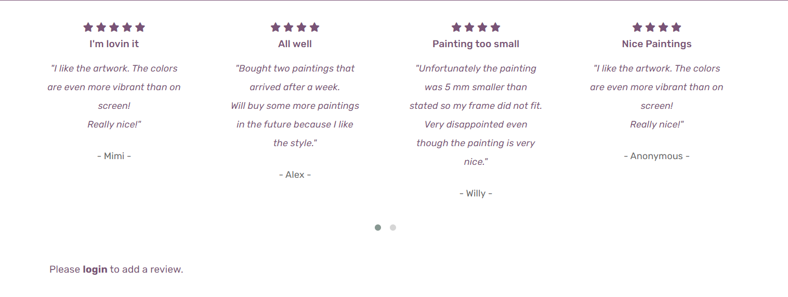
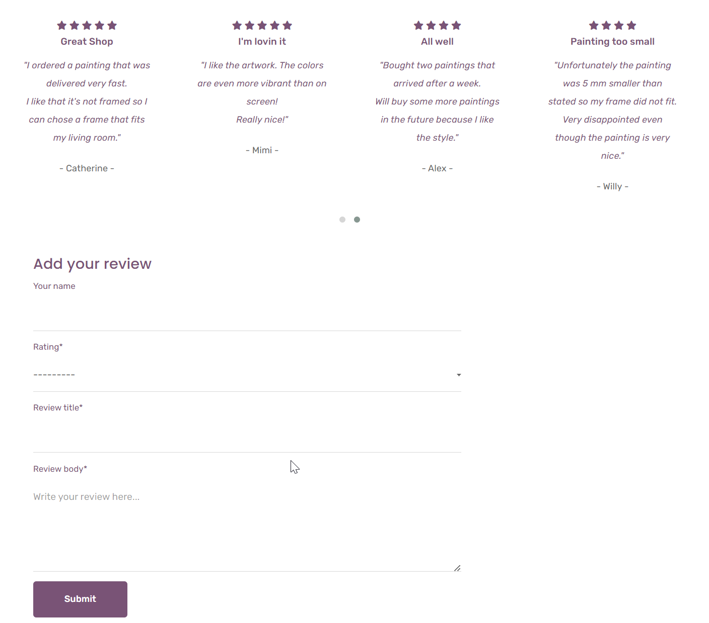
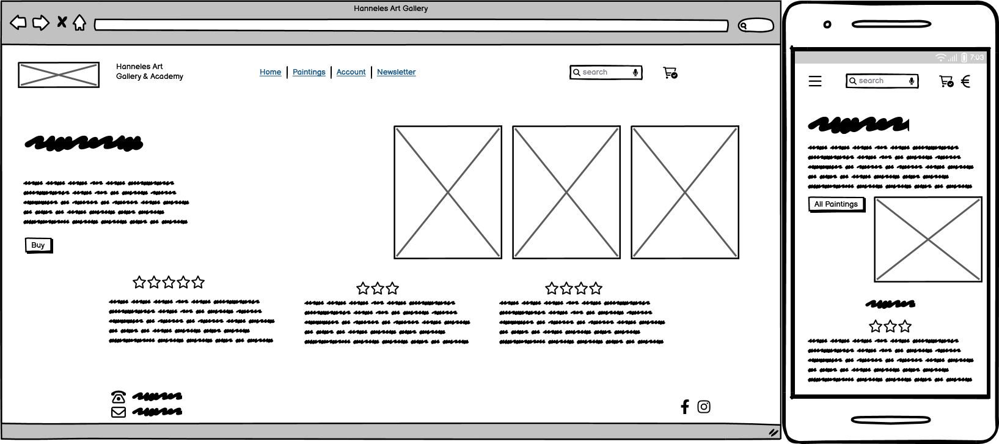
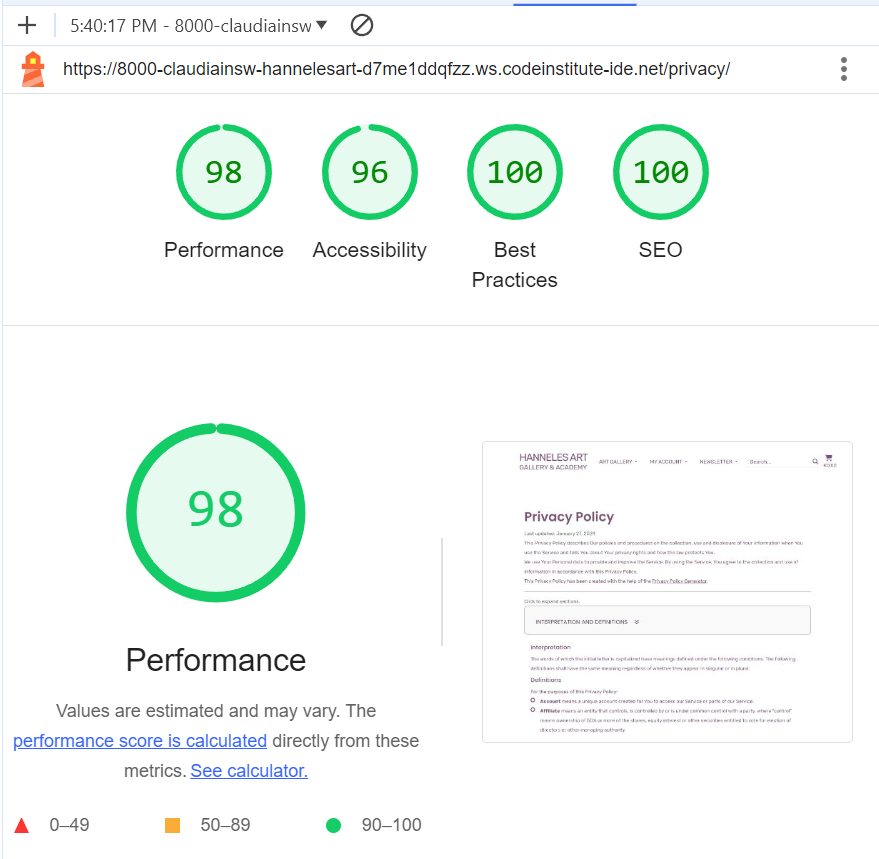

# Hanneles Art Gallery

## Introduction

### Project Description

[Hanneles Art Gallery](https://hanneles-art-gallery-99fb21934da8.herokuapp.com/) is a fictional eCommerce website that offers original paintings to affordable prices. 
The painting images and descriptions are used with kind permission of Hannele Kaarlejärvi, the artist. 

The webshop includes a preview of all painings with links to a larger image and more detailed information. The images can also be viewed in full size. Paintings can be added to the shopping cart but as they are unique only a quantity of 1 can be added. In the shopping cart, paintings can be removed, or the user can proceed to the checkout page. For Payment purposes the website is connected with Stripe. Test purchases can be performed with [Stripes test cards](https://stripe.com/docs/testing/).
User can also register for an account where the order history is stored.  

### Business Model

Hanneles Art Gallery is a B2C (Business to Customer) business even though also businesses can purchase paintings. 
Target group are users who want to decorate their homes but want to avoid off-the-shelf-prints and instead look for real paintings. 

#### Phase 1 (in scope for this project)
Hanneles Art Gallery sells a limited range of paintings to fair conditions. 

#### Phase 2 (out of scope for this project)
An "Art Academy" will be launched including a membership area where interested users may find tutorials about how to start painting and what tools to use. Beginners level tutorials will be free of charge and a member fee will be charged for more advanced tutorials. 

#### Phase 3 (out of scope for this project)
The webshop will widen its scope and start selling high quality tools for painting. 

### Web Marketing Strategy

#### Target Audience
According to [Interior Design magazine](https://interiordesign.net/designwire/women-in-design-confronting-the-glass-ceiling/) around 70% of all Interior Designers in the US are women and also in private homes it's often the women who choose the interior decor. Furthermore, many women see painting as an opportunity for self-expression and stress-reduction. For that reason the main target audience of the webshop as well as for phase 2 and 3 are women. 

#### Facebook Business Page
In the start phase of the business we will concentrate on Facebook as Marketing platform. That way the artist can create a more personal relationship with followers and keep the communication ongoing by answering comments and questions online. This allows also to test different approaches and validation.

By the time of writing this ReadMe file (2024-01-30) the businesses [Facebook Page Hanneles Art Gallery](https://www.facebook.com/profile.php?id=61555624246656) has 5 Followers.

#### Newsletter
A monthly newsletter will be created using Mailchimp services. The newsletter will contain information about new paintings available in the shop but also act as "appetizer" as we will tell some background stories about the making of the paintings and the inspiration behind it. 
It will also include information about exhibitions and other events. 

Users can easily find and subsribe to the newsletter on the Home Page of Hanneles Art Gallery. Only an email address is necessary to subscribe. All administration will be handled [by Mailchimps services](https://mailchimp.com/). 

### SEO - Search Engine Optimization
Prior to project start some brainstorming resultad in a number of short and long-tail keywords. Using three different browsers and a mobile, resulted in a couple of keyword volume and competition analysis results from [Wordtracker](https://www.wordtracker.com/).
Also Google search with suggested search phrases as well as related searches was used. However, original paintings seem to be a niche product and Googles suggestions were not comprehensive. 
The selected keywords and long-tail phrases where included in meta description and keywords as well as in the headings and button texts. 

Keyword Research Wordtracker

Screenshots Wordtracker Results:

Keyword Research Google

Screenshots Wordtracker Results:

#### sitemap.xml
To further improve searchability of the website a sitemap.xml file was included, using [XML Sitemaps.xml](https://www.xml-sitemaps.com/).

#### robots.txt
The robots.txt file allowes crawl access to all parts of the website but the accounts and checkout pages.

#### Privacy Policy
To comply with GDPR a Privacy Policy has been created using the [Privacy Policy Generator](https://www.privacypolicygenerator.info/). The layout was adapted to the style of the webshop and added to the footer of the Home Page. However, I noticed that the English in the auto-generated file is quite bad but as it was suggested to use this website during the course I used it anyway. 

### UX

As the webshop only sells paintings the focus in the design was on presenting the paintings. This was achieved with an overview page that allows for a good overview of all paintings (including filtering and sorting by price) and a large image of the painting when clicking on the "Click for details" button under each image. The user than can see a large image and can "study" the painting in detail before scrolling down to see short descriptions. As users usually don't buy a lot of paintings but take their time to choose one I concluded that a good picture is more important than size, format or price. 
The color scheme was chosen after the mostly female target group and is therefore in soft pinkish/lila colors, mixed with a darker nuance for better readability. 
Some of the images are unfortunately not well fotographed and have lopsided frame around the actual painting but as I didn't had access to the original paintings to take new pictures I left it as it is. 

A free Bootstrap 4 template was used to save time but it turned out that this was a bad decision. Only when almost finished I realized that the specific design of the template interferes with both the crispy form and stripe form. Also the button design was inconsistent which resulted in countless hours of trying to fix the design but due to time restraints I had to skip this, see section bugs. 
XXX

## Agile 

Agile Methodology was used during the project.
User stories were created at project start, and prioritized according to MOSCOW way of working. 
Github was used to document the user stories by using the build in Issues resp. project functionality.
For each user story a list of tasks and acceptance criterias was created.
Working progress was illustrated in a canban board.
All user stories labelled "Must have" have been closed. 
Open user stories have been collected in the backlog section. 

The project is open for public access and can be visited here.

## Relationship Diagram

## Features

### Navigation

The responsive navigation bar on top of the page includes links to the Home Page, a dropdown list to select either all paintings or filtered by category as well as a dropdown list with "My Account" which shows different options depending if the user is logged in and/or a superuser/admin. See details below.

Also available is a search bar and the shopping cart that shows the total amount of the items in the shopping cart in Euro. On small screens the amount is hidden and the logotype switches to a clickable icon, to allow a reasonable size of the search field.
The search field searches through title, painting technique, size and the category field and search results are displayed on the paintings overview page. An information text informs the user about the number of matches and a link back to the overview page.

The navigation bar is identical on each page (includes method is used) to enable easy navigation. It allows users to navigate between pages on all devices without the need to use the "back" button.

### Home Page

The Home page is the starting point for users. It displays one of the paintings and informs the user about the purpose of the website. Keywords and phrases are used in the short intro text and the button for improved SEO. 

The middle part of the page shows reviews that have been given from users. Both the heading and the review text are linked to the review page.

In the lower part of the page a subscription form for the newsletter is prominently placed. Mailchimp is used as provider.
Further down are links to selected social media accounts of which the link to Facebook directs to an actual Facebook page dedicated to Hanneles Art Gallery. 
On bottom of the page I had to put a link to the template origin as requested in the template license agreement and to the right the user can find a link to the Privacy Policy page that opens in a new tab. 

### Reviews

The reviews page displays given reviews including star rating. Also the average customer rating is visible. Depending on the log in status, a user will be prompted to log in to write a review or will see a personalized notification that a review has already been given.  

#### User not logged in

#### User is logged in

#### User has already submitted a review

### All Paintings

The All Paintings / Products page lists all paintings with an image and short information. On this page the price is not included on purpose as the main focus should be on the art. The details button leads to a product detail page with a large image of the painting and some information about the size and the used technique. 
A button in the bottom right corner enables a fast return to the top of the page at any moment.

The buttons "Update" and "Delete" are only visible for logged in administrators of the page. 

### Painting details

Again, the focus is on the painting and the user might need to scroll down to see the price.

To keep the interest alive and display a full collection of the artwork it's decided to leave the sold paintings in the shop but with a "SOLD" label and no price and no "Add to cart" button available. 
At the time of project submission there is not yet an automatically function implemented to change the status of a painting. This is possible through the product management page which is available for superusers. However, an automated function should be implemented in phase 2.

### Shopping cart

On the shopping cart page the user can see an overview of the paintings in the shopping cart as well as total costs including a delivery flat rate. As the paintings don't differ a lot in sizes and can easily be packaged I decided to use a flat rate for delivery. 
Here the user also has the possibility to remove a painting from the cart or go back to the paintings overview page. 

If the user deletes all items in the shopping cart some info text will be displayed, telling the user that the shopping cart is empty; and a button to the paintings overview page. 

If the user clicks the Complete checkout button the user will be directed to the checkout form. Also here the user can see what paintings are in the shopping cart and the total sum. 

### Checkout

On the checkout page the user can see a short summary of the order on the right side and a form on the left side. 
The form asks for name, email and the delivery address. When the user is already registered and logged in, the address will be pre-populated. As the location for the webshop is in Sweden, it was decided to use only the address fields that are common in Sweden, so state/county has not been used. 
On the bottom of the page you can find the Stripe credit card section for the user to fill in credit card number, valid date, CVV and zip code.
As only a Stripe test account is used, an error will be displayed when a credit card number other than the test card number 4242 ... is entered.
Also here the user can still choose to interrupt the checkout process and go back to the paintings page. 

When the user completes the form and clicks on Complete Order the Checkout Success/Order confirmation page is opened. 

### Order confirmation

While the payment transfer is ongoing a spinning overlay is displayed to inform the user that the transaction is ongoing.

Once the transaction is completed successfully an order confirmation page is displayed informing the user that a confirmation email has been sent to the provided email address. Also an order summary with the delivery address is visible as well as a button back to the paintings page. 

### My Account

Under the My Account menu tab in the navigation the user will see different options depending on the log-in status:
- When the user is not logged in a Registration and a Log-in Option are available. They open Allauth templates which are Bootstrap-styled to match the rest of the website. The log-in page offers also the possibility to restore the password in case it's been forgotten.
- When the user is already loggeg in, a Log-out option will be visible instead. 
- When a user is logged in as a superuser, the Product Management link is available that leads to a page that enables to add another painting. Contrary to the Walkthrough project the image upload is mandatory as we cannot sell paintings without being able to show them to the user. 

## Typography and color scheme

As already mentioned, the color scheme was selected to meet the taste of a mostly female target group. I also tried not to overload the pages but keep them clean and spacious. Main focus was on presenting the paintings. The Bootstrap template used the font "Rubik" which I liked very much and used in the project. It harmonizes very well with the layout and is good readable even in small sizes.

## Wireframes

Wireframes for desktop and smartphone have been created with 

### Homepage

### Reviews

### Products

### Product Details

### Shopping Cart

### Checkout

### Profile

## Technologies used

### Languages
- HTML5
- CSS
- JavaScript
- jQuery
- Python
- Django

### Technologies and programs
- IDE: Gitpod/VS Code
- Repository: GitHub
- Database: ElephantSQL
- Payment solution: Stripe
- Storage: AWS S3 for storing media and static files
- Deployment: Heroku

### Software and frameworks

## Testing

### Validator Testing

#### HTML

 No errors were returned when passing through the [W3C Markup validator](https://validator.w3.org/).
Details for each page can be found by clicking the expand button.
 

HTML Validation 

**Homepage**

**Reviews**

**Products**

**Product Details**

**Edit Product**

**Add Product**

**Cart**

**Checkout**

**Checkout success**

**Login**

**Logout**

**Signup**

**Profile**

**Privacy Policy**

#### CSS

No errors were found when passing through the [W3C CSS Validator](https://jigsaw.w3.org/css-validator/) validator

**base.css**

**checkout.css**

#### Google Chrome Lighthouse Reports

These reports presents the results of Lighthouse testing to assess the performance, accessibility, best practices and SEO of Hanneles Art Gallery.

The tests were executed using the Google Chrome browser's DevTools.
performanceDetails for each page can be found by clicking the expand button.

Lighthouse Performance 

**Homepage**

**Reviews**

**Products**

**Product Details**

**Edit Product**

**Add Product**

**Cart**

**Checkout**

**Checkout success**

**Login**

**Logout**

**Signup**

**Profile**

**Privacy Policy**

#### JavaScript validation
Due to lack of time this step could not be performed.

#### Python validation
No errors were returned when passing through the [CI Python Linter](https://pep8ci.herokuapp.com/).
Details for each part can be found by clicking the expand button.
 

Home 

**model.py**

**forms.py**

**views.py**

Products 

**model.py**

**forms.py**

**views.py**

Cart 

**model.py**

**forms.py**

Checkout 

**model.py**

**forms.py**

**views.py**

**model.py**

**forms.py**

**views.py**

Profiles 

**model.py**

**forms.py**

**views.py**

## Browser Testing

Functionality, links, layout, and responsiveness were tested with the following browsers without any major issues:

- Microsoft Edge Version 117.0.2045.47
- Firefox Version 118.0.1
- Brave Version 1.58.135
- Google Chrome Version 116.0.5845.188
  

## Bugs
Due to a bug regarding Stripe webhooks hours of research were spent and finally solved with help from Rebecca from Tutor Service.
However, due to this major issue, the project could not be finalized on time.

## Credits

All painting images belong to Hannele Hannele Kaarlejärvi

![Bootstrap-4-multi-dropdown-navbar:]
